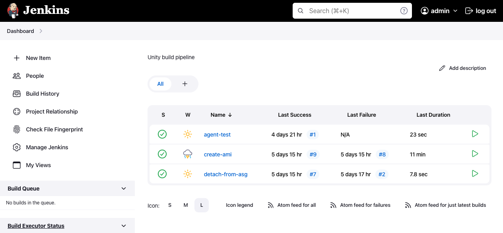
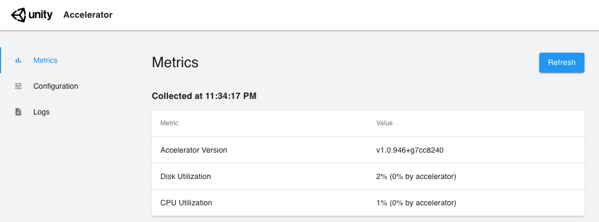
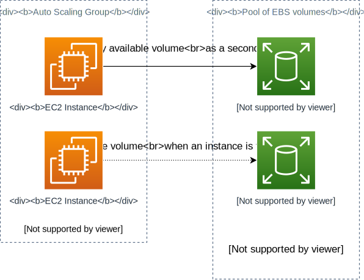

# Unity Build Pipeline with Jenkins and EC2 Mac
[](https://github.com/aws-samples/jenkins-unity-build-on-aws/actions/workflows/build.yml)

This is a starter kit for Unity build pipeline with Jenkins and EC2 Linux/Mac instances on AWS.

Features include:

* Jenkins controller on ECS Fargate
* Jenkins agents on EC2 Linux Spot and EC2 Mac instances
* Optional container support for Jenkins agents
* Unity Accelerator on EC2
* Periodic AMI replacement to keep build cache warm
* A warm pool of Amazon EBS volumes to maintain intermediate caches
* Highly automated provisioning through AWS Cloud Development Kit (CDK)

## Overview
Here is the architecture of this project. 
Please also read [How it works section](#how-it-works) for additional consideration on this architecture.


All the AWS resources in the diagram are provisioned automatically using AWS CDK.

## Deploy
To deploy this project to your own AWS account, please follow the steps below.

### 0. Prerequisites
You must have the following dependencies installed to deploy this sample:

* [Node.js](https://nodejs.org/en/download/) (v16 or newer)
* [Docker](https://docs.docker.com/get-docker/)
* [AWS CLI](https://docs.aws.amazon.com/cli/latest/userguide/getting-started-install.html) and a configured IAM profile with Administrator policy

### 1. Set parameters
Before you deploy it, you need to set several parameters.

The Jenkins controller's initial admin password is set in [jenkins.yaml.ejs](lib/construct/jenkins/resources/config/jenkins.yaml.ejs).
It is recommended to update the password to a sufficiently strong one (the default is `passw0rd`.)

```yaml
      users:
        - id: admin
          password: passw0rd
```

Please open [bin/jenkins-unity-build.ts](./bin/jenkins-unity-build.ts). There are a few parameters you can configure.

```ts
new JenkinsUnityBuildStack(app, 'JenkinsUnityBuildStack', {
  env: { 
    region: 'us-east-2',
    // account: '123456789012',
  },
  allowedCidrs: ['127.0.0.1/32'],
  // certificateArn: "",
});
```

The `allowedCidrs` property specifies IP address ranges that can access the Jenkins web UI ALB.
You should set these ranges as narrowly as possible to prevent unwanted users from accessing your Jenkins UI.

To change the AWS region (the default is us-east-2, Ohio), please replace `region: us-east-2` with another region.

For additional security, you can [create an AWS Certificate Manager certificate](https://docs.aws.amazon.com/acm/latest/userguide/gs-acm-request-public.html), and import it by setting `certificateArn` and `env.account` in the above code to encrypt the data transferred through the ALB with TLS.
By default, Jenkins Web GUI is accessed via HTTP.

### 2. Setup CDK
After confirming the parameters, you can proceed to CDK deployment.

First, you need to setup the CDK environment by running the following command:

```sh
npm ci
npx cdk bootstrap
```

You only need those commands once for your AWS environment (pair of account ID and region.)

### 3. Run cdk deploy
Now you are ready to deploy the CDK project.

```sh
npx cdk deploy
```

The first deployment should take about 15 minutes. You can also use the `npx cdk deploy` command to deploy when you change your CDK templates in the future.

After a successful deployment, you will get a CLI output as below:

```
 ✅  JenkinsUnityBuildStack

✨  Deployment time: 67.1s

Outputs:
JenkinsUnityBuildStack.JenkinsMacAgent1InstanceId39041E59 = i-xxxxxxxxxxx
JenkinsUnityBuildStack.JenkinsMasterServiceLoadBalancerDNS8A32739E = Jenki-Jenki-1234567890.us-east-2.elb.amazonaws.com
JenkinsUnityBuildStack.JenkinsMasterServiceServiceURL6DCB4BEE = http://Jenki-Jenki-1234567890.us-east-2.elb.amazonaws.com
JenkinsUnityBuildStack.UnityAcceleratorEndpointC89B3A26 = accelerator.build:10080
JenkinsUnityBuildStack.UnityAcceleratorInstanceIdC7EEEEA7 = i-yyyyyyyyyyy
```

By opening the URL in `JenkinsMasterServiceServiceURL` output, you can now access to Jenkins Web GUI.
Please login with the username and password you entered in `jenkins.yaml.ejs`. 



**NOTE:** You may observe that the Jenkins controller initialization process takes longer time (>3 minutes), because Jenkins needs to copy all the required files to an [Amazon EFS volume](https://aws.amazon.com/efs/) on the very first boot. If you see a 503 error, please reload the page after a few minutes and you will get a login page soon. You will NOT see such a long initialization after the second boot because all the files have already been copied to the EFS volume.

### 4. Provision EC2 Mac instance
Note that EC2 Mac instances are not yet provisioned.
To provision one, **you have to uncomment the `macAmiId` property** in [bin/jenkins-unity-build.ts](./bin/jenkins-unity-build.ts) and provide an AMI ID for the instance.


```ts
new JenkinsUnityBuildStack(app, 'JenkinsUnityBuildStack', {
  macAmiId: 'ami-0xxxxxx', // Provide the AMI ID 
});
```

Technically, you do NOT have to deploy Mac instances and other resources separately, but in this example we deliberately separate them to avoid possible rollback and rollback failure. A Mac dedicated host has [some limitations](https://docs.aws.amazon.com/AWSEC2/latest/UserGuide/ec2-mac-instances.html#mac-instance-release-dedicated-host) that complicate the CloudFormation rollback process.

You can obtain an AMI ID for Mac instances from [the AMI Catalog](https://console.aws.amazon.com/ec2/v2/home#AMICatalog:). We use Intel Mac by default, so please select the `64-bit (Mac)` version. If you want to use the Apple silicon (M1 or Mac-Arm) version, open [`jenkins-unity-build-stack.ts`](lib/jenkins-unity-build-stack.ts) and change `instanceType` property of an `AgentMac` construct. Please also careful about the AWS region of your management console; it must match the region where you deployed the system. 


You will also need to **check the quota** for your AWS account to run a Mac instance. See [`Service Quotas` page](https://console.aws.amazon.com/servicequotas/home/services/ec2/quotas). You have to increase the quotas with the following name:

* Running Dedicated mac1 Hosts: the number of Intel Mac instances
* Running Dedicated mac2 Hosts: the number of M1 Mac instances (Only if you select `mac2.metal` as the `instanceType` property)


When all of the above are confirmed, run `npx cdk deploy` command again and your Mac instance will be provisioned and registered as a Jenkins agent.

**NOTE:** It is possible that the availability zone in which you tried to deploy the instance does not support Mac instances yet.
If you see a provisioning error, you can change the AZ using the code in [`jenkins-unity-build-stack.ts`](lib/jenkins-unity-build-stack.ts).

```ts
    new AgentMac(this, 'JenkinsMacAgent1', {
      vpc,
      // change this to subnet: vpc.privateSubnets[0]
      subnet: vpc.privateSubnets[1],
```

### 5. (Optional) Setup the EC2 Mac instance
To use the Mac instance for a Unity build, you may want to configure it manually (e.g. by installing Xcode or other dependencies).
You can configure it using Remote Desktop and reuse the configuration for another Mac instance.
Please refer to the [Setup EC2 Mac instance](docs/setup-mac-instance.md) document for more details.

## Usage
After the deployment, you can test the system using the pre-installed Jenkins jobs.

* Run `agent-test` job to test all registered Jenkins agents (EC2 Linux, Mac, Docker).
    * the job definition can be found at [agentTestJob.xml](lib/construct/jenkins/resources/config/agentTestJob.xml)
* Run `detach-from-asg` job to create an AMI from a Linux agent and update its ASG configuration.
    * the job definition can be found at [detachFromAsg.xml](lib/construct/jenkins/resources/config/detachFromAsg.xml)
    * it invokes the `createAmi` job to actually create a AMI

To build a Unity client or asset bundle, you can freely use Linux agents and Mac agents to implement your build pipeline.
The available agent labels are the following:

* `linux`: Agents of Amazon Linux 2. It is intended for heavy tasks.
* `small`: Agents of Amazon Linux 2 but for smaller tasks (will run on t3.small).
* `mac`: Agents of EC2 Mac instances.

In addition, both `linux` and `small` support the [Docker plugin](https://plugins.jenkins.io/docker-plugin/).

A sample Jenkinsfile for building an iOS client using these agents can be found [here](https://github.com/tmokmss/com.unity.multiplayer.samples.coop/blob/main/Jenkinsfile).
Note that this sample job requires you to prepare a Unity license and iOS signing certificates in order to run properly.

It is also recommended to additionally use [Unity floating license server](https://unity.com/products/unity-build-server) to manage your Unity licenses.
To deploy a license server, you can use this sample project: [Unity Build Server with AWS CDK](https://github.com/aws-samples/unity-build-server-with-aws-cdk)

### Accessing Unity Accelerator
You can make the build faster by using [Unity Accelerator](https://docs.unity3d.com/Manual/UnityAccelerator.html), which is already included and running in this sample.

You can access the accelerator from Jenkins agents using the `$UNITY_ACCELERATOR_ENDPOINT` environment variable or the endpoint `accelerator.build:10080`.
To use it from Unity Editor batch mode, add the following command arguments. See [this forum thread](https://forum.unity.com/threads/usage-in-batchmode.819543/) for more details:

```sh
unity-editor \
    -cacheServerEndpoint "accelerator.build:10080" \
    -cacheServerNamespacePrefix "MyProject" \
    -cacheServerEnableDownload true \
    -cacheServerEnableUpload true \
    -adb2 -enableCacheServer
```

You can access the accelerator's web UI to view detailed metrics or the current running status. Use SSM port-forwarding to access it locally.

```sh
# Look for the accelerator's instance ID in the EC2 management console.
aws ssm start-session \
    --target i-xxxxxxxxxxxxxx \
    --document-name AWS-StartPortForwardingSession \
    --parameters '{"portNumber":["80"], "localPortNumber":["8080"]}'
```

Then open `http://localhost:8080` and you will see a page like the one below.



When prompted for credentials, use the following:

* username: admin
* password: passw0rd

These values are specified in [unity-accelerator-init-config.yaml](lib/construct/resources/unity-accelerator-init-config.yaml), and you can change them as you like by modifying the yaml file and running `cdk deploy`.

The performance of Unity Accelerator can be improved by placing the instance in the same availability zone as the build agents, due to the lower latency between them.
You can try this configuration by explicitly setting a subnet in [`jenkins-unity-build-stack.ts`](lib/jenkins-unity-build-stack.ts).

```ts
    const accelerator = new UnityAccelerator(this, 'UnityAccelerator', {
      // omitted
      subnet: vpc.privateSubnets[0],
    });

    const agentEc2 = new AgentEC2(this, 'JenkinsLinuxAgent', {
      // omitted
      subnets: [vpc.privateSubnets[0]],
    });
```

### Add another Mac instance
By default, we provision only one instance for EC2 Mac. You can add more Mac instances by the following steps.

1. Check Quotas
    * You have to have enough quotas to provision your Mac instances. See [`Service Quotas` page](https://console.aws.amazon.com/servicequotas/home/services/ec2/quotas). Please also refer to [this section](#4-provision-ec2-mac-instance) for more details.
2. Modify the CDK code
    * Open [`jenkins-unity-build-stack.ts`](lib/jenkins-unity-build-stack.ts) and add new Mac agents to the `macAgents` list. See the below code:
    ```ts
    if (props.macAmiId != null) {
      macAgents.push(
        new AgentMac(this, 'JenkinsMacAgent1', {
          // omitted
        }),
      );

      // Add this
      macAgents.push(
        // Note that you need to make the 2nd argument unique
        new AgentMac(this, 'JenkinsMacAgent2', {
          // copy all the properties from above.

          // You can set the AMI ID created from your first Mac instance here
          // to avoid having to rebuild the environment (e.g. installing Xcode).
          // See also docs/setup-mac-instance.md.
          amiId: 'ami-xxxxxxxxxxx',
        }),
      );
    }
    ```
3. Deploy
    * Run `npx cdk deploy` command. When the deployment is complete, you will see a new Mac instance registered as a Jenkins agent.

## How it works
This project requires several architectural considerations, which we will cover in this section.

### Offload build tasks from Mac instances to Linux spots
To reduce the cost of EC2 Mac instances, it is desirable to use EC2 Linux spot instances as well as EC2 Mac instances to build Unity applications.

Most parts of the Unity build process can be done on Linux servers, while specifically Xcode build requires a Mac instance.
By offloading those build tasks to EC2 Linux spot instances, which are relatively inexpensive and have a shorter minimum billing period, you can reduce the number of Mac instances and ultimately save on infrastructure costs while still keeping the overall length of a build job short enough.


You can also refer to this [reference architecture](https://d1.awsstatic.com/architecture-diagrams/ArchitectureDiagrams/unity-build-pipeline-ios-games-on-aws-cloud-ra.pdf) for more details.

When it comes to using spot instances, we must be aware of [spot interruptions](https://docs.aws.amazon.com/AWSEC2/latest/UserGuide/spot-interruptions.html) - the build jobs can sometimes get interrupted in the middle of build processes. However, they are handled well by the [Jenkins EC2 Fleet plugin](https://github.com/jenkinsci/ec2-fleet-plugin). The plugin detects spot interruptions and automatically re-enqueue the suspended jobs.

### Automatically update AMI for build agents
Since EC2 Linux Spot instances are stateless, all the internal states of an instance (e.g. filesystem) are purged when an instance is terminated (e.g. by scaling activities.) This can slow down build processes because many build systems rely on caches of intermediate artifacts in a build server's filesystem, assuming that they are shared between build jobs, which is not always the case on stateless servers.

However, we can share these caches between build jobs even in our Linux spot based system by using [Amazon Machine Images (AMI)](https://docs.aws.amazon.com/AWSEC2/latest/UserGuide/AMIs.html).
An AMI contains a snapshot of the filesystem of an instance ([Amazon EBS](https://aws.amazon.com/ebs/) snapshot.) If we create an AMI from an existing EC2 instance that was previously used for a Unity build job, any instance launched from the AMI will have warmed caches ready as soon as it is initialized.We can even create AMIs periodically to keep the caches updated.
By using AMIs, it is possible to overcome the drawbacks of stateless instances and make the build process fast as if they were stateful.

When creating an AMI from a build server, we need to be careful about the following facts:

1. An instance should be rebooted when an AMI is created from it to ensure the consistency of the snapshot ([doc](https://docs.aws.amazon.com/toolkit-for-visual-studio/latest/user-guide/tkv-create-ami-from-instance.html))
2. An instance must not belong to an auto scaling group, since it can be terminated by the ASG when it is rebooted.
3. During AMI creation, a Unity build job should not be running on the instance. This may break the cache consistency.
4. During AMI creation, [spot interruption](https://docs.aws.amazon.com/AWSEC2/latest/UserGuide/spot-interruptions.html) can happen to the instance, causing the build to fail. To mitigate this, we need a retry mechanism.

With all of the above in mind, we include a sample Jenkins job to periodically create and update AMIs for Linux Jenkins agents.


The `detachFromAsg` job is intended to be called periodically (e.g. by using [Jenkins cron job](https://www.jenkins.io/doc/book/pipeline/syntax/#cron-syntax)) and will attempt to create an AMI and update the ASG as needed. You can reference the implementation and integrate it into your own build system.

The disadvantage of using AMI for caching, however, is that it takes some time to fully fetch (hydrate) EBS snapshots, resulting in higher I/O latency during the hydration. In some situations, the hydration process takes too long to be used as a cache. One solution to this the problem is to use the Fast Snapshot Restore feature, which allows the volume to be hydrated immediately without much I/O latency ([Addressing I/O latency when restoring Amazon EBS volumes from EBS Snapshots](https://aws.amazon.com/blogs/storage/addressing-i-o-latency-when-restoring-amazon-ebs-volumes-from-ebs-snapshots/)).

Note that if you are using FSR, you should be aware of [volume creation credits](https://docs.aws.amazon.com/AWSEC2/latest/UserGuide/ebs-fast-snapshot-restore.html#volume-creation-credits) and [additional charges](https://docs.aws.amazon.com/AWSEC2/latest/UserGuide/ebs-fast-snapshot-restore.html#fsr-pricing).

There is another way to avoid this problem and solve the caching problem at the same time, which is described in the next section.

### Maintain a pool of EBS volumes
The problem with using AMI (and EBS snapshots) is the initial higher I/O latency because all the snapshot data is stored in S3 and lazily loaded into volumes.

To avoid this problem, we maintain a warm pool of EBS volumes and attach an available volume each time a new EC2 instance is added. 



When an instance is terminated, the volume is automatically detached from the instance, and becomes available for the next instances.

This way, we do not need to use EBS snapshot and are therefore free from the snapshot hydration. This method requires an EC2 instance to dynamically select an available EBS volume from the pool, attach it, and mount it as a file system. We do this in EC2 user data, and the implementation is included in this sample. See [agent-userdata.sh](./lib/construct/jenkins/resources/agent-userdata.sh). 

Note that you need to properly estimate the required capacity for the pool. The number of volumes should be equal to the maximum capacity of the Auto Scaling Group (ASG), otherwise some instances will not get available volume immediately, or some volumes will not be used at all. The ASG capacity can be determined by how many build jobs you want to run concurrently. If it is too small, your job queue will soon be piled up, or if it is too large, your infrastructure costs will be unnecessarily high. You may want to analyze the tradeoffs and determine an optimal value for the ASG capacity.

By default, this pool is enabled for the agents with the `linux` label. If you want to disable it, open [`jenkins-unity-build-stack.ts`](lib/jenkins-unity-build-stack.ts) and change the code as shown below. Since this change places the Jenkins workspace in the root volume, you may want to increase the size of the root volume at the same time.

```diff
  const agentEc2 = new AgentEC2(this, 'JenkinsLinuxAgent', {
    vpc,
    sshKeyName: keyPair.keyPairName,
    artifactBucket,
    // increase root volume size
-   rootVolumeSize: Size.gibibytes(30),
+   rootVolumeSize: Size.gibibytes(200),
    // remove dataVolumeSizeGb property
-   dataVolumeSize: Size.gibibytes(200),
```

## Clean up
To avoid incurring future charges, clean up the resources you created.

To remove all the AWS resources deployed by this sample, please follow these steps:

1. Set the minimum Jenkins Linux agent fleet size to zero. You can set this in the Jenkins cloud configuration UI (Dashboard -> Manage Jenkins -> Nodes -> Configure Clouds -> Minimum Cluster Size). Please confirm that all Linux nodes have been removed from the Jenkins controller. You should wait for at least `Max Idle Minutes Before Scaledown` minutes before nodes will be removed.
    * We need to do this because the [Jenkins EC2 Fleet plugin](https://plugins.jenkins.io/ec2-fleet/) sets the scale-in protection policy of the fleets to enabled, which prevents CFn from deleting the instances.
2. Run the following command to delete the CloudFormation stack.
    ```sh
    npx cdk destroy --force
    ```
3. Manually release the EC2 Mac dedicated host. Detailed instructions can be found here: [Release Dedicated Hosts
](https://docs.aws.amazon.com/AWSEC2/latest/UserGuide/how-dedicated-hosts-work.html#dedicated-hosts-releasing). Note that sometimes a Mac dedicated host cannot be released immediately (e.g. 1-3 hours after a Mac instance in the host has been terminated or less than 24 hours after the host was created.) In this case, you must wait and retry the operation.
1. Make sure to deregister all the unnecessary AMIs and EBS snapshots if you have created any: [Deregister your AMI](https://docs.aws.amazon.com/AWSEC2/latest/UserGuide/deregister-ami.html)

## Security
See [CONTRIBUTING](CONTRIBUTING.md#security-issue-notifications) for more information.

## License
This library is licensed under the MIT-0 License. See the LICENSE file.
